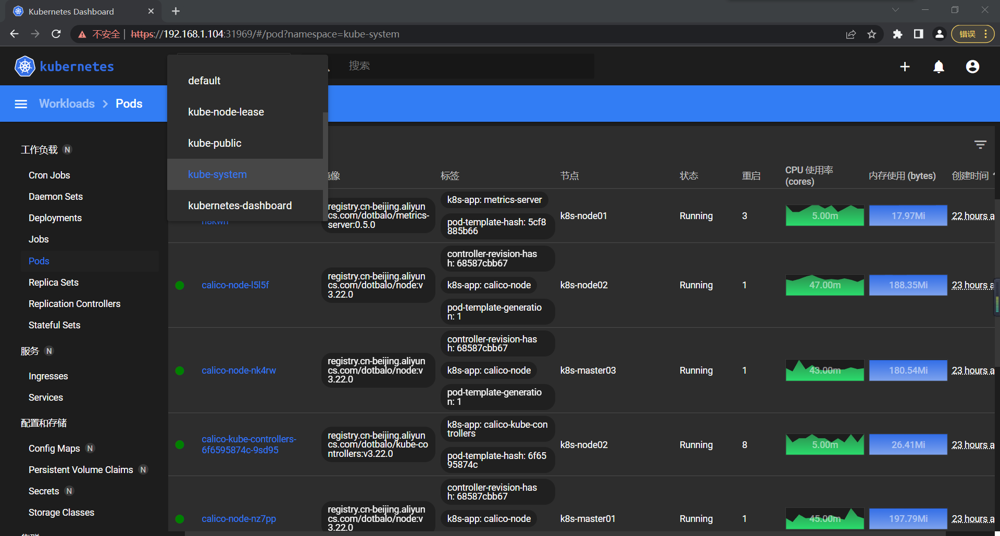

### 一、准备五台服务器（可以使用虚拟机）<br >

1.注意宿主机、Service网段、Pod网段不能重复
```
k8s-master01    2C3G    40G    192.168.1.101
k8s-master02    2C3G    40G    192.168.1.102
k8s-master03    2C3G    40G    192.168.1.103
k8s-node01      2C3G    40G    192.168.1.104
k8s-node02      2C3G    40G    192.168.1.105

vip的ip地址我定义为   192.168.1.201

```
2.查看虚拟机的版本

````
[root@k8s-master01 ~]# cat /etc/redhat-release
CentOS Linux release 7.9.2009 (Core)
````
### 二、基本环境配置
1.编辑hosts文件，每台机器都需要配置，配置完成后各节点可以互相ping测试一下<br />
````
vi /etc/hosts


127.0.0.1   localhost localhost.localdomain localhost4 localhost4.localdomain4
::1         localhost localhost.localdomain localhost6 localhost6.localdomain6

192.168.1.101 k8s-master01
192.168.1.102 k8s-master02
192.168.1.103 k8s-master03
192.168.1.104 k8s-node01
192.168.1.105 k8s-node02
````

2.每台机器都安装centos的yum源 <br/>
```
curl -o /etc/yum.repos.d/CentOS-Base.repo \
https://mirrors.aliyun.com/repo/Centos-7.repo

#工具
yum install -y yum-utils device-mapper-persistent-data lvm2

yum-config-manager --add-repo \
https://mirrors.aliyun.com/docker-ce/linux/centos/docker-ce.repo

```
3.必备工具安装 <br />
````
yum install wget jq psmisc vim net-tools telnet \
yum-utils device-mapper-persistent-data lvm2 git -y
````

4.安装ntpdate，用于同步时间
````
rpm -ivh http://mirrors.wlnmp.com/centos/wlnmp-release-centos.noarch.rpm
yum install ntpdate -y
````
5.yum升级
````
yum update -y --exclude=kernel*
````
6.所有节点安装ipvsadm
````
yum install ipvsadm ipset sysstat conntrack libseccomp -y
````
7.设置kubernetes国内镜像
````
cat <<EOF > /etc/yum.repos.d/kubernetes.repo
[kubernetes]
name=Kubernetes
baseurl=https://mirrors.aliyun.com/kubernetes/yum/repos/kubernetes-el7-x86_64/
enabled=1
gpgcheck=0
repo_gpgcheck=0
gpgkey=https://mirrors.aliyun.com/kubernetes/yum/doc/yum-key.gpg https://mirrors.aliyun.com/kubernetes/yum/doc/rpm-package-key.gpg
EOF


sed -i -e '/mirrors.cloud.aliyuncs.com/d' -e '/mirrors.aliyuncs.com/d' \
/etc/yum.repos.d/CentOS-Base.repo
````
8.关闭所有节点的防火墙、selinux、dnsmasq、swap
````
systemctl disable --now firewalld
#可能关闭失败,因为你压根没有这个服务,那就不用管了
systemctl disable --now dnsmasq
#公有云不要关闭
systemctl disable --now NetworkManager

setenforce 0
sed -i 's#SELINUX=enforcing#SELINUX=disabled#g' /etc/sysconfig/selinux
sed -i 's#SELINUX=enforcing#SELINUX=disabled#g' /etc/selinux/config
````
9.关闭swap分区
````
swapoff -a && sysctl -w vm.swappiness=0
sed -ri '/^[^#]*swap/s@^@#@' /etc/fstab
````

10.所有节点同步时间
```` 
ln -sf /usr/share/zoneinfo/Asia/Shanghai /etc/localtime
echo 'Asia/Shanghai' >/etc/timezone
ntpdate time2.aliyun.com
#加入到crontab
crontab -e

*/5 * * * * /usr/sbin/ntpdate time2.aliyun.com
````
11.所有节点配置limit
````
ulimit -SHn 65535

vim /etc/security/limits.conf
#末尾添加如下内容
* soft nofile 65536
* hard nofile 131072
* soft nproc 65535
* hard nproc 655350
* soft memlock unlimited
* hard memlock unlimited

````
12.master01节点配置免秘钥登录其他节点<br />
配置完成之后使用ssh工具测试一下
````
ssh-keygen -t rsa

for i in k8s-master01 k8s-master02 k8s-master03 k8s-node01 k8s-node02; \
do ssh-copy-id -i .ssh/id_rsa.pub $i;done
````
13.下载安装所有的源码文件
````
cd /root/
#国内下载
git clone https://gitee.com/dukuan/k8s-ha-install.git
#国外下载就用这个
git clone https://github.com/dotbalo/k8s-ha-install.git
````
## 三、内核配置
1.在master01节点下载内核 <br />
内核尽量升级至4.18+，推荐4.19，生产环境必须要升级
````
cd /root
wget http://193.49.22.109/elrepo/kernel/el7/x86_64/RPMS/kernel-ml-devel-4.19.12-1.el7.elrepo.x86_64.rpm
wget http://193.49.22.109/elrepo/kernel/el7/x86_64/RPMS/kernel-ml-4.19.12-1.el7.elrepo.x86_64.rpm

````
````如果上面下载不了， 建议去qq上面 k8s安装文档群 里下载 之后传到其他节点上````

2.从master01节点传到其他节点
````
for i in k8s-master02 k8s-master03 k8s-node01 k8s-node02; \
do scp kernel-ml-4.19.12-1.el7.elrepo.x86_64.rpm \
kernel-ml-devel-4.19.12-1.el7.elrepo.x86_64.rpm $i:/root/ ; done
````
3.所有节点安装内核
````
cd /root
yum localinstall -y kernel-ml*
````

4.所有节点更改内核启动顺序
````
grub2-set-default 0 && grub2-mkconfig -o /etc/grub2.cfg
grubby --args="user_namespace.enable=1" --update-kernel="$(grubby --default-kernel)"
````

5.检查默认内核是不是4.19
````
[root@k8s-master01 ~]# grubby --default-kernel
/boot/vmlinuz-4.19.12-1.el7.elrepo.x86_64

````
6.所有节点配置ipvs模块 <br \>
在内核4.19+版本nf_conntrack_ipv4已经改为nf_conntrack，4.18以下使用nf_conntrack_ipv4就可以了

````

modprobe -- ip_vs
modprobe -- ip_vs_rr
modprobe -- ip_vs_wrr
modprobe -- ip_vs_sh
modprobe -- nf_conntrack

vim /etc/modules-load.d/ipvs.conf
#加入以下内容
ip_vs
ip_vs_lc
ip_vs_wlc
ip_vs_rr
ip_vs_wrr
ip_vs_lblc
ip_vs_lblcr
ip_vs_dh
ip_vs_sh
ip_vs_fo
ip_vs_nq
ip_vs_sed
ip_vs_ftp
ip_vs_sh
nf_conntrack
ip_tables
ip_set
xt_set
ipt_set
ipt_rpfilter
ipt_REJECT
ipip
````
7.设置开机启动
````
systemctl enable --now systemd-modules-load.service
````
8.开启k8s集群中必须的内核参数，所有节点都要配置k8s内核
````
cat <<EOF > /etc/sysctl.d/k8s.conf
net.ipv4.ip_forward=1
net.bridge.bridge-nf-call-iptables=1
net.bridge.bridge-nf-call-ip6tables=1
fs.may_detach_mounts=1
net.ipv4.conf.all.route_localnet=1
vm.overcommit_memory=1
vm.panic_on_oom=0
fs.inotify.max_user_watches=89100
fs.file-max=52706963
fs.nr_open=52706963
net.netfilter.nf_conntrack_max=2310720

net.ipv4.tcp_keepalive_time=600
net.ipv4.tcp_keepalive_probes=3
net.ipv4.tcp_keepalive_intvl=15
net.ipv4.tcp_max_tw_buckets=36000
net.ipv4.tcp_tw_reuse=1
net.ipv4.tcp_max_orphans=327680
net.ipv4.tcp_orphan_retries=3
net.ipv4.tcp_syncookies=1
net.ipv4.tcp_max_syn_backlog=16384
net.ipv4.ip_conntrack_max=65536
net.ipv4.tcp_max_syn_backlog=16384
net.ipv4.tcp_timestamps=0
net.core.somaxconn=16384
EOF


sysctl --system

````
9.检查模块有没有被加载进来

````
lsmod | grep --color=auto -e ip_vs -e nf_conntrack

#重启所有机器再次检查
reboot
lsmod | grep --color=auto -e ip_vs -e nf_conntrack

````

```
上面所有的步骤可以拍个快照，因为二进制安装的步骤前面是一模一样的
```

## 四、k8s组件和Runtime安装
### 1.Containerd作为Runtime <br />
(1)所有节点安装docker-ce-20.10

````
yum install docker-ce-20.10.* docker-ce-cli-20.10.* -y
````
``` 不需要启动Docker，可以直接配置启动Containerd ```

(2)所有节点配置Containerd需要的模块
```
cat <<EOF | sudo tee /etc/modules-load.d/containerd.conf
overlay
br_netfilter
EOF

```
(3)所有节点加载模块
````
modprobe -- overlay
modprobe -- br_netfilter
````
(4)所有节点配置Containerd所需的内核
````
cat <<EOF | sudo tee /etc/sysctl.d/99-kubernetes-cri.conf
net.bridge.bridge-nf-call-iptables=1
net.ipv4.ip_forward=1
net.bridge.bridge-nf-call-ip6tables=1
EOF


#加载内核
sysctl --system

````
(5)所有节点配置Containerd的配置文件
````
mkdir -p /etc/containerd
containerd config default | tee /etc/containerd/config.toml
````
(6)所有节点将Containerd的Cgroup改为Systemd
````
vim /etc/containerd/config.toml

#找到containerd.runtimes.runc.options,将SystemdCgroup改为true
SystemdCgroup=true

#找到sandbox_image,并将Pause镜像改成符合自己版本的地址
#registry.cn-hangzhou.aliyuncs.com/google_containers/pause:3.6
sandbox_image="registry.cn-hangzhou.aliyuncs.com/google_containers/pause:3.6"

````
(7)所有节点启动Containerd，并设置开机启动

````
systemctl daemon-reload
systemctl enable --now containerd

````
(8)所有节点配置crictl客户端连接的运行时位置
````
cat > /etc/crictl.yaml <<EOF
runtime-endpoint: unix:///run/containerd/containerd.sock
image-endpoint: unix:///run/containerd/containerd.sock
timeout: 10
debug: false
EOF


#测试containerd
ctr image ls
````

### 2.安装kubernetes组件
(1)所有节点安装1.23版本的kubeadm、kubelet和kubectl
````
yum install kubeadm-1.23* kubelet-1.23* kubectl-1.23* -y

````
(2)查看版本
````
[root@k8s-master01 ~]# kubeadm version
kubeadm version: &version.Info{Major:"1", Minor:"23", GitVersion:"v1.23.9", GitCommit:"c1de2d70269039fe55efb98e737d9a29f9155246", GitTreeState:"clean", BuildDate:"2022-07-13T14:25:37Z", GoVersion:"go1.17.11", Compiler:"gc", Platform:"linux/amd64"}
You have new mail in /var/spool/mail/root

````
(3)所有节点更改kubelet的配置使用Containerd作为Runtime
````
cat >/etc/sysconfig/kubelet<<EOF
KUBELET_KUBEADM_ARGS="--container-runtime=remote --runtime-request-timeout=15m 
--container-runtime-endpoint=unix:///run/containerd/containerd.sock"
EOF

````
(4)所有节点设置kubelet开机自启动
````
systemctl daemon-reload
systemctl enable --now kubelet

````
````如果启动失败是正常的，因为kubelet还没有配置，报错不用管````

## 五、高可用组件的安装
````如果你不是高可用集群，这部分可以不用看了，直接跳过去下一节；如果你用的是公有云，公有云有自带的负载均衡，比如阿里云的SLB、腾讯云的ELB，可以用于代替haproxy和keepalived，公有云大部分不支持keepalived，另外，如果你用阿里云，kubectl控制端不能放在master节点，推荐使用腾讯云，因为阿里云的SLB有回环的问题，也就是SLB代理的服务器不能反向访问SLB，但是腾讯云修复了这个bug````
1.所有Master节点通过yum安装haproxy和keepalived
````
yum install keepalived haproxy -y
````
2.所有master节点配置haproxy
````
mkdir /etc/haproxy

vim /etc/haproxy/haproxy.cfg

global
  maxconn 2000
  ulimit-n 16384
  log 127.0.0.1 local0 err
  stats timeout 30s
defaults
  log global
  mode http
  option httplog
  timeout connect 5000
  timeout client 50000
  timeout server 50000
  timeout http-request 15s
  timeout http-keep-alive 15s
frontend monitor-in
  bind *:33305
  mode http
  option httplog
  monitor-uri /monitor
frontend k8s-master
  bind 0.0.0.0:16443
  bind 127.0.0.1:16443
  mode tcp
  option tcplog
  tcp-request inspect-delay 5s
  default_backend k8s-master
backend k8s-master
  mode tcp
  option tcplog
  option tcp-check
  balance roundrobin
  default-server inter 10s downinter 5s rise 2 fall 2 slowstart 60s maxconn 250 maxqueue 256 weight 100
  server k8s-master01 192.168.1.101:6443 check
  server k8s-master02 192.168.1.102:6443 check
  server k8s-master03 192.168.1.103:6443 check

````
3.所有master节点重启haproxy并检查
````
systemctl restart haproxy
#检查16443端口有没有被监听
netstat -nltp

````
4.各master节点配置keepalived
````
mkdir /etc/keepalived

vim /etc/keepalived/keepalived.conf
! Configuration File for keepalived
global_defs {
    router_id LVS_DEVEL
    script_user root
    enable_script_security
}
vrrp_script chk_apiserver {
    script "/etc/keepalived/check_apiserver.sh"
    interval 5
    weight -5
    fall 2  
    rise 1
}
vrrp_instance VI_1 {
    state MASTER
    interface ens33 #网卡名称使用你自己的
    mcast_src_ip 192.168.1.101 #ip地址使用你自己的
    virtual_router_id 51
    priority 101
    advert_int 2
    authentication {
        auth_type PASS
        auth_pass K8SHA_KA_AUTH
    }
    virtual_ipaddress {
        192.168.1.201
    }
    track_script {
        chk_apiserver
    }
}

````
````
mkdir /etc/keepalived

vim /etc/keepalived/keepalived.conf
! Configuration File for keepalived
global_defs {
    router_id LVS_DEVEL
    script_user root
    enable_script_security
}
vrrp_script chk_apiserver {
    script "/etc/keepalived/check_apiserver.sh"
    interval 5
    weight -5
    fall 2  
    rise 1
}
vrrp_instance VI_1 {
    state BACKUP
    interface ens33
    mcast_src_ip 192.168.1.102
    virtual_router_id 51
    priority 100
    advert_int 2
    authentication {
        auth_type PASS
        auth_pass K8SHA_KA_AUTH
    }
    virtual_ipaddress {
        192.168.1.201
    }
    track_script {
        chk_apiserver
    }
}

````
````
mkdir /etc/keepalived

vim /etc/keepalived/keepalived.conf
! Configuration File for keepalived
global_defs {
    router_id LVS_DEVEL
    script_user root
    enable_script_security
}
vrrp_script chk_apiserver {
    script "/etc/keepalived/check_apiserver.sh"
    interval 5
    weight -5
    fall 2  
    rise 1
}
vrrp_instance VI_1 {
    state BACKUP
    interface ens33
    mcast_src_ip 192.168.1.103
    virtual_router_id 51
    priority 100
    advert_int 2
    authentication {
        auth_type PASS
        auth_pass K8SHA_KA_AUTH
    }
    virtual_ipaddress {
        192.168.1.201
    }
    track_script {
        chk_apiserver
    }
}

````
5.所有master节点配置KeepAlived健康检查文件
````
vim /etc/keepalived/check_apiserver.sh 
#!/bin/bash
err=0
for k in $(seq 1 3)
do
    check_code=$(pgrep haproxy)
    if [[ $check_code == "" ]]; then
        err=$(expr $err + 1)
        sleep 1
        continue
    else
        err=0
        break
    fi
done
if [[ $err != "0" ]]; then
    echo "systemctl stop keepalived"
    /usr/bin/systemctl stop keepalived
    exit 1
else
    exit 0
fi


chmod +x /etc/keepalived/check_apiserver.sh

````
6.启动haproxy和keepalived

````
systemctl daemon-reload
systemctl enable --now haproxy
systemctl enable --now keepalived
````
7.测试keepalived是否正常
````
[root@k8s-master01 ~]# ping 192.168.1.102
PING 192.168.1.102 (192.168.1.102) 56(84) bytes of data.
64 bytes from 192.168.1.102: icmp_seq=1 ttl=64 time=1.07 ms
64 bytes from 192.168.1.102: icmp_seq=2 ttl=64 time=0.340 ms
64 bytes from 192.168.1.102: icmp_seq=3 ttl=64 time=0.500 ms
64 bytes from 192.168.1.102: icmp_seq=4 ttl=64 time=0.571 ms
64 bytes from 192.168.1.102: icmp_seq=5 ttl=64 time=0.538 ms
64 bytes from 192.168.1.102: icmp_seq=6 ttl=64 time=0.519 ms
64 bytes from 192.168.1.102: icmp_seq=7 ttl=64 time=0.613 ms
^C
--- 192.168.1.102 ping statistics ---
7 packets transmitted, 7 received, 0% packet loss, time 6125ms
rtt min/avg/max/mdev = 0.340/0.594/1.079/0.214 ms


[root@k8s-master01 ~]# telnet 192.168.1.102 16443
Trying 192.168.1.102...
Connected to 192.168.1.102.
Escape character is '^]'.
Connection closed by foreign host.

````
```` 
如果ping不通且telnet没有出现]，则认为VIP不可以，不可在继续往下执行，需要排查keepalived的问题，比如防火墙和selinux，haproxy和keepalived的状态，监听端口等 所有节点查看防火墙状态必须为disable和inactive：systemctl status firewalld
所有节点查看selinux状态，必须为disable：getenforce
master节点查看haproxy和keepalived状态：systemctl status keepalived haproxy
master节点查看监听端口：netstat -lntp 
````
## 六、集群初始化
````
该章节部分所有操作都是在master01节点执行，除非有注明其他节点
注意，如果不是高可用集群，192.168.1.201:16443改为master01的地址，16443改为apiserver的端口，默认是6443，注意更改kubernetesVersion的值和自己服务器kubeadm的版本一致：kubeadm version
````
1.master01节点创建kubeadm-config.yaml配置文件
````
vim kubeadm-config.yaml

apiVersion: kubeadm.k8s.io/v1beta2
bootstrapTokens:
- groups:
  - system:bootstrappers:kubeadm:default-node-token
  token: 7t2weq.bjbawausm0jaxury
  ttl: 24h0m0s
  usages:
  - signing
  - authentication
kind: InitConfiguration
localAPIEndpoint:
  advertiseAddress: 192.168.1.101 #改成你自己master01的ip地址
  bindPort: 6443
nodeRegistration:
  # criSocket: /var/run/dockershim.sock #如果是Docker作为Runtime配置此项
  criSocket: /run/containerd/containerd.sock #如果是Containerd作为Runtime配置此项
  name: k8s-master01  # 注意改成你对应的master1机器
  taints:
  - effect: NoSchedule
    key: node-role.kubernetes.io/master
---
apiServer:
  certSANs:
  - 192.168.1.201 #改成vip或者是公有云负载均衡的地址
  timeoutForControlPlane: 4m0s
apiVersion: kubeadm.k8s.io/v1beta2
certificatesDir: /etc/kubernetes/pki
clusterName: kubernetes
controlPlaneEndpoint: 192.168.1.201:16443 #改成vip或者是公有云负载均衡的地址和端口号
controllerManager: {}
dns:
  type: CoreDNS
etcd:
  local:
    dataDir: /var/lib/etcd
imageRepository: registry.cn-hangzhou.aliyuncs.com/google_containers
kind: ClusterConfiguration
kubernetesVersion: v1.23.9  #更改此处的版本号和kubeadm version一致
networking:
  dnsDomain: cluster.local
  podSubnet: 172.16.0.0/12 #pod
  serviceSubnet: 10.96.0.0/16 #service
scheduler: {}

````
````如果上面出现粘贴乱序情况可以按住shift+: 然后输入set paste回车再粘贴即可````
2.更新kubeadm文件
````
kubeadm config migrate --old-config kubeadm-config.yaml --new-config new.yaml
````
3.将new.yaml文件复制到其他master节点
````
for i in k8s-master02 k8s-master03; do scp new.yaml $i:/root/; done
````
4.所有的master节点提前下载镜像
````可以节省初始化时间，为了初始化更快，无需关心其他节点配置文件````
````
kubeadm config images pull --config /root/new.yaml
````
5.master01节点初始化
````
kubeadm init --config /root/new.yaml  --upload-certs

#如果初始化失败，重置后再次初始化
kubeadm reset -f ; ipvsadm --clear  ; rm -rf ~/.kube

#如果重置后初始化还是失败可以去查看日志
tail -f /var/log/messages

````
6.让其他节点加入集群
````
Your Kubernetes control-plane has initialized successfully!

To start using your cluster, you need to run the following as a regular user:

  #推荐使用这个配置环境变量，配置完这个环境变量可以执行kubectl get node检测一下
  mkdir -p $HOME/.kube
  sudo cp -i /etc/kubernetes/admin.conf $HOME/.kube/config
  sudo chown $(id -u):$(id -g) $HOME/.kube/config

Alternatively, if you are the root user, you can run:

  export KUBECONFIG=/etc/kubernetes/admin.conf

You should now deploy a pod network to the cluster.
Run "kubectl apply -f [podnetwork].yaml" with one of the options listed at:
  https://kubernetes.io/docs/concepts/cluster-administration/addons/

You can now join any number of the control-plane node running the following command on each as root:

  #其他master节点可以使用这个命令加入
  kubeadm join 192.168.1.201:16443 --token 7t2weq.bjbawausm0jaxury \
        --discovery-token-ca-cert-hash sha256:4dad6d6b981090463d6546c581f4cf9a3c6510f1704c0be642b80b30421957d6 \
        --control-plane --certificate-key 0c696fddbb54b90da0eeea2888d251435b593de21715a3623de07c9fd13613bb

Please note that the certificate-key gives access to cluster sensitive data, keep it secret!
As a safeguard, uploaded-certs will be deleted in two hours; If necessary, you can use
"kubeadm init phase upload-certs --upload-certs" to reload certs afterward.

Then you can join any number of worker nodes by running the following on each as root:

#node节点可以使用这个命令加入
kubeadm join 192.168.1.201:16443 --token 7t2weq.bjbawausm0jaxury \
        --discovery-token-ca-cert-hash sha256:4dad6d6b981090463d6546c581f4cf9a3c6510f1704c0be642b80b30421957d6 

````
7.高可用master
````
#生成新的token，把结果复制到其他节点上运行就可以使用新token加入了
[root@k8s-master01 ~]# kubeadm token create --print-join-command
kubeadm join 192.168.1.201:16443 --token 6xwn4f.t1ei1n8ccmj0ux1m --discovery-token-ca-cert-hash 
sha256:4dad6d6b981090463d6546c581f4cf9a3c6510f1704c0be642b80b30421957d6

#master节点需要生成--certificate-key
#把最后一行新生成的key放于--control-plane --certificate-key后面
[root@k8s-master01 ~]# kubeadm init phase upload-certs  --upload-certs
I0722 12:47:41.424929   18458 version.go:255] remote version is much newer: v1.24.3; falling back to: stable-1.23
[upload-certs] Storing the certificates in Secret "kubeadm-certs" in the "kube-system" Namespace
[upload-certs] Using certificate key:
1da32ac9f6ee04d960f1ee4249794fd2c58a60eb45ca42f9f172b4bfe5336f4e

```` 

## 七、Calico安装
````以下步骤只在master01执行````

1.进入1.23版本的calico目录
````
cd /root/k8s-ha-install && git checkout manual-installation-v1.23.x && cd calico/
````
2.修改pod网段
````
POD_SUBNET=`cat /etc/kubernetes/manifests/kube-controller-manager.yaml | grep cluster-cidr= | awk -F= '{print $NF}'`
#修改后查看
[root@k8s-master01 calico]# echo $POD_SUBNET
172.16.0.0/12
#修改calico.yaml
sed -i "s#POD_CIDR#${POD_SUBNET}#g" calico.yaml
#安装
kubectl apply -f calico.yaml
````
3.检测calico
```当所有的STATUS都为Running，并且READY为1/1的时候，就可以往下一节继续安装其他的了```
````
[root@k8s-master01 calico]# kubectl get po -n kube-system
NAME                                       READY   STATUS    RESTARTS      AGE
calico-kube-controllers-6f6595874c-9sd95   1/1     Running   0             13m
calico-node-5ppdl                          1/1     Running   0             13m
calico-node-hlx62                          1/1     Running   0             13m
calico-node-l5l5f                          1/1     Running   0             13m
calico-node-nk4rw                          1/1     Running   0             13m
calico-node-nz7pp                          1/1     Running   0             13m
calico-typha-6b6cf8cbdf-v8fl7              1/1     Running   0             13m
coredns-65c54cc984-flvws                   1/1     Running   0             78m
coredns-65c54cc984-jqp98                   1/1     Running   0             78m
etcd-k8s-master01                          1/1     Running   0             78m
etcd-k8s-master02                          1/1     Running   0             51m
etcd-k8s-master03                          1/1     Running   0             36m
kube-apiserver-k8s-master01                1/1     Running   0             78m
kube-apiserver-k8s-master02                1/1     Running   0             51m
kube-apiserver-k8s-master03                1/1     Running   0             36m
kube-controller-manager-k8s-master01       1/1     Running   1 (51m ago)   78m
kube-controller-manager-k8s-master02       1/1     Running   0             51m
kube-controller-manager-k8s-master03       1/1     Running   0             36m
kube-proxy-6zl79                           1/1     Running   0             78m
kube-proxy-f9msv                           1/1     Running   0             36m
kube-proxy-pb8r9                           1/1     Running   0             52m
kube-proxy-rzm7b                           1/1     Running   0             39m
kube-proxy-tkkj2                           1/1     Running   0             52m
kube-scheduler-k8s-master01                1/1     Running   1 (51m ago)   78m
kube-scheduler-k8s-master02                1/1     Running   0             51m
kube-scheduler-k8s-master03                1/1     Running   0             36m
````
## 八、Metrics部署
1.将master01节点的front-proxy-ca.crt复制到所有node节点
````
scp /etc/kubernetes/pki/front-proxy-ca.crt k8s-node01:/etc/kubernetes/pki/front-proxy-ca.crt
scp /etc/kubernetes/pki/front-proxy-ca.crt k8s-node02:/etc/kubernetes/pki/front-proxy-ca.crt
````
2.安装metrics server
````
#跳转到k8s-ha-install目录
cd ..

[root@k8s-master01 k8s-ha-install]# kubectl apply -f kubeadm-metrics-server/
serviceaccount/metrics-server created
clusterrole.rbac.authorization.k8s.io/system:aggregated-metrics-reader created
clusterrole.rbac.authorization.k8s.io/system:metrics-server created
rolebinding.rbac.authorization.k8s.io/metrics-server-auth-reader created
clusterrolebinding.rbac.authorization.k8s.io/metrics-server:system:auth-delegator created
clusterrolebinding.rbac.authorization.k8s.io/system:metrics-server created
service/metrics-server created
deployment.apps/metrics-server created
apiservice.apiregistration.k8s.io/v1beta1.metrics.k8s.io created
````
3.查看状态
```
[root@k8s-master01 ~]# kubectl get po -n kube-system -l k8s-app=metrics-server
NAME                              READY   STATUS    RESTARTS   AGE
metrics-server-5cf8885b66-h8kwh   1/1     Running   0          9m32s
```

## 九、安装dashboard
1.进入指定目录
````
cd /root/k8s-ha-install/dashboard/
````
2.安装
````
kubectl create -f .

````
3.查看端口号并访问
````
[root@k8s-master01 dashboard]# kubectl get svc -n kubernetes-dashboard
NAME                        TYPE        CLUSTER-IP     EXTERNAL-IP   PORT(S)         AGE
dashboard-metrics-scraper   ClusterIP   10.96.85.109   <none>        8000/TCP        2m40s
kubernetes-dashboard        NodePort    10.96.207.57   <none>        443:31969/TCP   2m41s

````
````我的端口号是31969，但你们的可能不一样，然后使用node节点的ip地址加上端口号用浏览器访问 注意要使用https，不然会有错误 https://192.168.1.104:31969````
4.登录token
````
kubectl -n kube-system describe secret \
$(kubectl -n kube-system get secret | grep admin-user | awk '{print $1}')
````
````把获取到的token复制到浏览器就可以登录了，如下图dashboard安装完成````



## 十、收尾工作
1.将kube-proxy改为ipvs模式
````
kubectl edit cm kube-proxy -n kube-system
#找到mode改为ipvs
mode: "ipvs"
````
2.更新kube-proxy的pod
````
kubectl patch daemonset kube-proxy -p \
"{\"spec\":{\"template\":{\"metadata\":{\"annotations\":{\"date\":\"`date \
+'%s'`\"}}}}}" -n kube-system

````
3.验证
````
[root@k8s-master01 dashboard]# curl 127.0.0.1:10249/proxyMode
ipvs
 ````
4.查看Taints

```` 
[root@k8s-master01 dashboard]# kubectl describe node -l node-role.kubernetes.io/master=  | grep Taints
Taints:             node-role.kubernetes.io/master:NoSchedule
Taints:             node-role.kubernetes.io/master:NoSchedule
Taints:             node-role.kubernetes.io/master:NoSchedule

````
5.删除上面的Taints
````
[root@k8s-master01 dashboard]# kubectl taint node -l node-role.kubernetes.io/master node-role.kubernetes.io/master:NoSchedule-
node/k8s-master01 untainted
node/k8s-master02 untainted
node/k8s-master03 untainted

#再次查看
[root@k8s-master01 dashboard]# kubectl describe node -l node-role.kubernetes.io/master=  | grep Taints
Taints:             <none>
Taints:             <none>
Taints:             <none>

````
